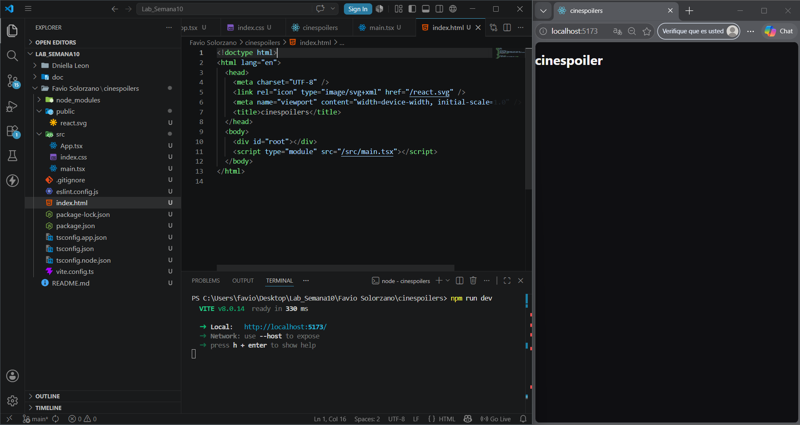
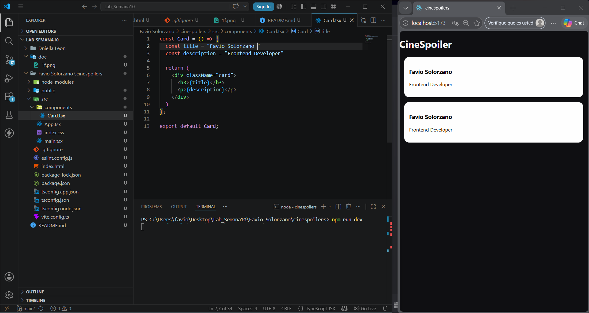
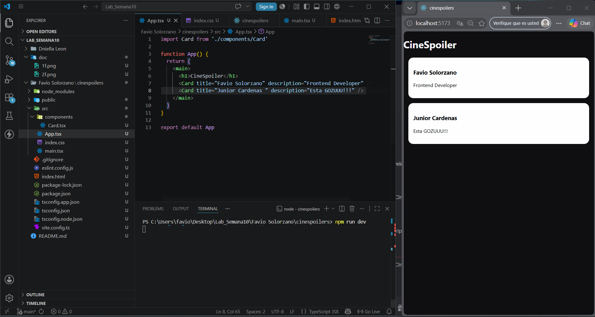
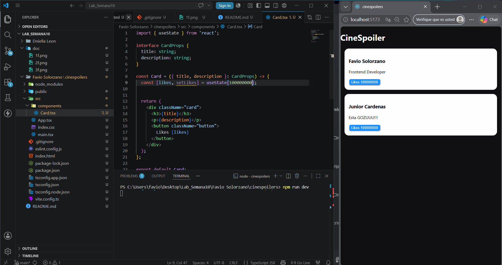
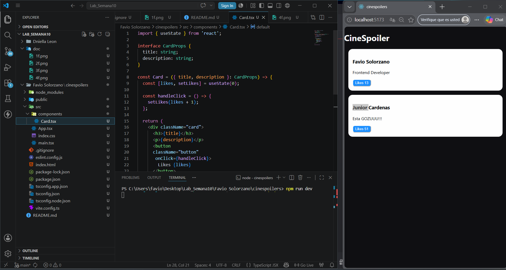

# Ingredientes: 

## -Favio Solorzano
## -Daniella Leon

## Ingrediente: Favio Solorzano

### 1 Dando la primera impreción 

### 2 Dandole los Cards

### 3 Cards con Diferente Textos 

### 4 Aplicando botones

### 5 Botones con clik De conteo 

## Ingrediente: Daniella Leon

### 1 Proyecto limpio 

### 2 Creaccion de componente

### 3 Implementacion de Props

### 4 Componente con Estados

### 5 Actualizar estados con eventos

